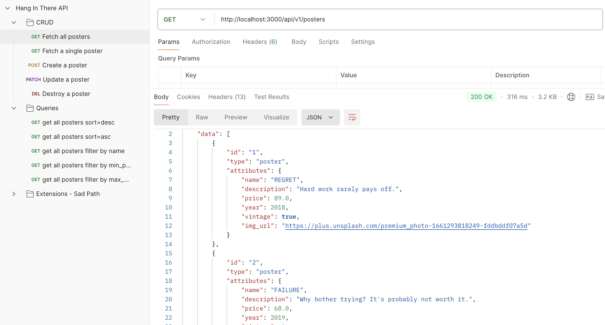

# Hang in There API

### Abstract:

This project involved building a back-end API to dynamically serve data for the motivational posters application, eliminating the need for hardcoded data on the front-end. The API supports full CRUD operations, enabling efficient management and interaction with poster data by the client.

Through this project, we gained hands-on experience designing and implementing a RESTful API that facilitates smooth communication between the client and server. We integrated a serializer to structure and format JSON responses, ensuring clean, consumable data for the front-end. Extensive testing was performed to validate the API endpoints, ensuring requests were handled correctly and responses met expected outcomes.

On the back-end, we utilized SQL and ActiveRecord to query, filter, and manipulate data, implementing features like filtering posters by name or price range, as well as sorting them in ascending or descending order. This provided a scalable and dynamic solution for managing our posters, keeping the front-end up-to-date with real-time data without requiring manual updates.

### Installation Instructions:

1. Fork this repository
2. Clone down your new, forked repo
3. `cd` into the repository
4. Open it in your text editor

### Preview of App:

### Context:

This was a pair project in mod 2. We were given a week to complete the project.

### Contributors:

[Jim Macur: GitHub Profile](https://github.com/jimmacur) 
[Jim Macur: LinkedIn Profile](https://www.linkedin.com/in/jimmacur/) 

[Shawn Thompson: GitHub Profile](https://github.com/SThompson05) 
[Shawn Thompson: LinkedIn Profile](https://www.linkedin.com/in/shawn-thompson24/)

### Learning Goals:

- Expose an API
- Use serializers to format JSON responses
- Test API exposure
- Use SQL and AR to gather data
- Breaking down a problem into small steps
- Practice individual research (articles, videos, mentors)

### Wins + Challenges:

One of our biggest accomplishments in this project was the quality of our tests. Although it was challenging at times to determine the correct data attributes to target, how to call them, and define the expected results, these obstacles helped us improve our ability to write precise, meaningful test cases. Crafting effective test assertions—deciding what should pass or fail—was crucial to ensuring our code performed as expected.

This project also strengthened our understanding of how the key elements—seeds, routes, serializer, and controllers—work together to make an API and database function smoothly. Each component plays a distinct role, but mastering the controller logic was particularly important. The Controller is the brains behind the operation, managing the flow of data and coordinating interactions between routes and models.

One of the biggest challenges was grasping how the various components—like routes, controllers, serializers, and the database—integrated and worked together seamlessly. Understanding the flow of data between each layer and how they interact was key to building a cohesive system. We incorporated the lessons we learned in class throughout the week to acheive success.

Ultimately, this experience deepened our ability to structure clean, efficient code in a real-world API environment.
